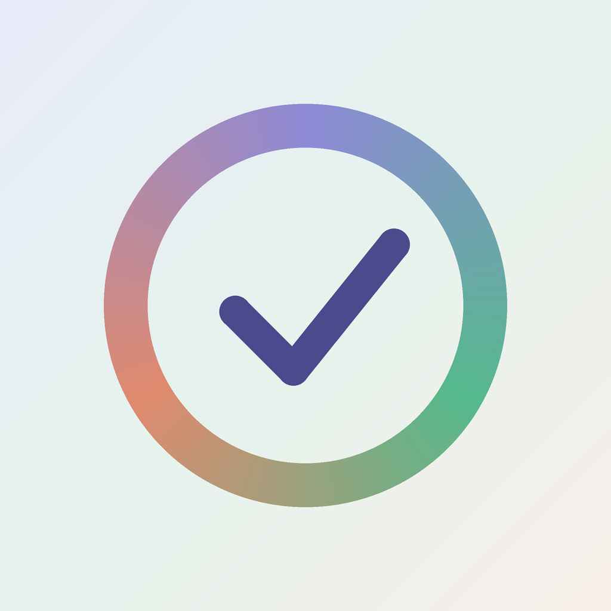
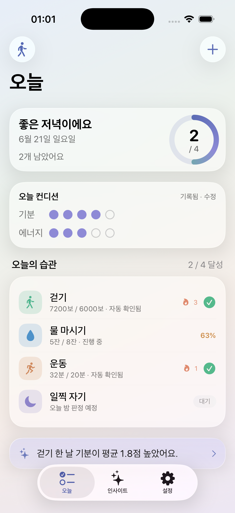
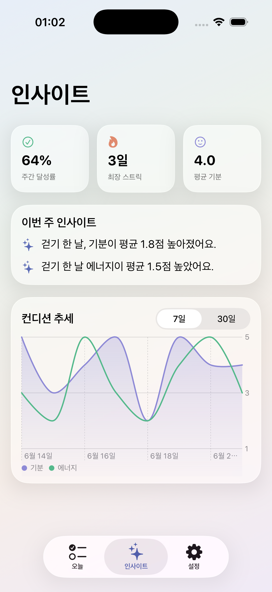
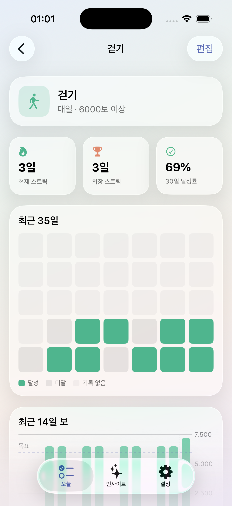
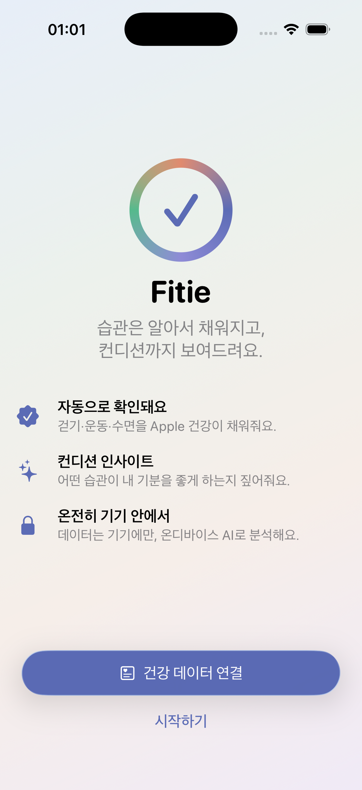
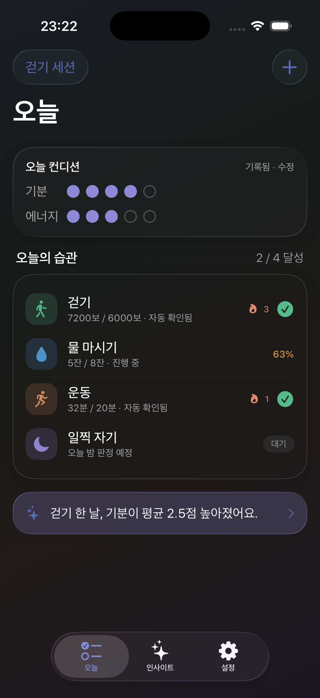
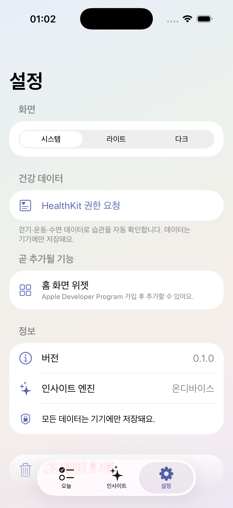

<div align="center">



# Fitie

**손으로 체크하지 않아도 HealthKit이 알아서 채워주는 정직한 습관 트래커**
그리고 그 습관이 내 컨디션을 어떻게 바꾸는지 온디바이스 AI가 짚어주는 앱

<br/>


</div>

---

## 한 줄 소개

대부분의 습관 앱은 사용자가 직접 "완료"를 누릅니다. **Fitie는 실제 건강 데이터로 습관 완료를 자동 판정합니다.** 같은 데이터가 매일의 컨디션(기분·에너지)과 엮여 "어떤 습관이 내 컨디션을 좋게 하는가"라는 인사이트로 이어집니다.

핵심은 **HealthKit을 공유 엔진**으로 쓴다는 점입니다. 같은 데이터를 (1) 습관 자동 판정과 (2) 컨디션 상관 분석에 두 번 활용하기 때문에, 기능 수는 적어도 깊이가 있습니다.

## 스크린샷

| 오늘 | 인사이트 | 습관 상세 |
|:---:|:---:|:---:|
|  |  |  |

| 온보딩 | 다크 모드 | 설정 |
|:---:|:---:|:---:|
|  |  |  |

## 주요 기능

- 🩺 **자동 판정 습관** — 걷기·물·수면·운동·마음챙김 등 HealthKit 규칙을 습관에 연결하면 매일 자동으로 달성 여부를 판정합니다. 데이터가 없는 습관(독서 등)은 탭해서 직접 체크할 수 있습니다.
- 🔥 **정직한 스트릭** — 앱 실행 시 지나간 날을 확정(finalize)해 미달성 날이 조용히 스트릭을 끊지 않습니다. 하루치 결과를 스냅샷으로 캐싱해 과거 기록이 안정적입니다.
- 💚 **컨디션 체크인** — 하루 한 번 기분·에너지(1–5)와 한 줄 메모를 30초 만에 기록합니다.
- 🧠 **주간 AI 인사이트** — "X한 날 컨디션이 평균 N점 높았어요" 같은 관찰형 인사이트. **숫자는 전부 Swift가 계산하고, 온디바이스 Foundation Models는 문장만 표현**합니다. 모델 미가용 시 템플릿 폴백으로 자동 전환됩니다.
- 📅 **기록 캘린더** — 월 단위 달력에서 달성 상태를 한눈에 보고, 과거의 특정 날을 다시 판정하거나 컨디션을 나중에 기록할 수 있습니다.
- 📊 **습관별 달성률 & 상관 차트** — Swift Charts로 컨디션 추세, 습관별 30일 달성률, 습관↔컨디션 상관을 시각화합니다.
- 🔔 **스마트 리마인더** — 반복 트리거 대신 7일 롤링 재예약 방식. 오늘 이미 달성한 습관은 오늘 알림을 건너뜁니다.
- 📲 **Live Activity** — 사용자가 시작하는 걷기/스트레칭 세션의 진행 링을 잠금화면에 표시합니다.
- 🔒 **완전 로컬** — 계정·로그인·클라우드 동기화 없이 모든 데이터가 온디바이스에 저장됩니다. JSON 백업 내보내기 지원.

## 아키텍처

핵심 원칙: **각 유닛은 단일 목적 + 잘 정의된 인터페이스 + 독립 테스트 가능.** 프로토콜 격리로 시뮬레이터/실기기, 멤버십 유무, 모델 가용성 차이를 구현체 교체로 흡수합니다.

```
Fitie/
├─ Models/         # SwiftData 모델 (Habit, DailyResult, ConditionEntry, InsightSnapshot)
├─ Health/         # HealthDataSource 프로토콜 + HealthKit / Mock 구현
├─ Logic/          # 순수 로직 코어 (HabitEvaluator, InsightEngine, StreakCalculator …)
├─ Insights/       # InsightPhraser 프로토콜 + FoundationModels / Template 구현
├─ Services/       # Store(SwiftData), RefreshService, NotificationService …
├─ Live/           # Live Activity (ActivityKit)
└─ Views/          # SwiftUI 화면 (Today, Insights, History, Settings …)
```

| 유닛 | 역할 |
|---|---|
| `HealthDataSource` *(프로토콜)* | HealthKit 추상화 — `HealthKitDataSource`(실제) / `MockHealthDataSource`(테스트·프리뷰). 시뮬/실기기 차이를 흡수하는 핵심 seam |
| `HabitEvaluator` | 순수 로직: 규칙 + 측정값 → 달성 상태. 프레임워크 의존 0 |
| `InsightEngine` | 순수 통계: DailyResult + ConditionEntry → 구조화 인사이트. 프레임워크 의존 0 |
| `InsightPhraser` *(프로토콜)* | 인사이트 → 문장 — `FoundationModelsPhraser` / `TemplatePhraser`(폴백), 가용성으로 자동 선택 |
| `RefreshService` | 오케스트레이션: HealthKit 조회 → 평가 → DailyResult 저장 → 인사이트 재계산 |
| `Store` *(SwiftData)* | 영속화 계층 |

순수 로직 코어(`HabitEvaluator`, `InsightEngine`)는 의존성이 없어 단위테스트로 높은 신뢰도를 얻고, 프레임워크 접점은 프로토콜 뒤 얇은 어댑터로 모킹합니다.

### AI 인사이트 가드레일

- 인과·의학적 조언 금지 — "~한 날 컨디션이 높았어요" 같은 **관찰**로만 표현합니다.
- **최소 표본 게이트**(양쪽 각 3일 이상) 미달 시 인사이트를 숨겨 통계적 노이즈를 차단합니다.
- 숫자는 항상 결정적 집계 단계에서 오며, **모델은 절대 숫자를 만들지 않습니다.**

## 기술 스택

Swift 6 · SwiftUI · SwiftData · HealthKit · ActivityKit · UserNotifications · Swift Charts · Foundation Models(온디바이스 AI) · Swift Testing · XcodeGen

## 시작하기

> **요구사항:** Xcode 26+, iOS 26 시뮬레이터, [XcodeGen](https://github.com/yonaskolb/XcodeGen)

```bash
brew install xcodegen        # 최초 1회
git clone https://github.com/mxvixxn/Fitie.git
cd Fitie
xcodegen generate            # project.yml → Fitie.xcodeproj 생성
open Fitie.xcodeproj
```

프로젝트 파일은 `project.yml` 하나로 타깃·capability·entitlements·Info.plist를 선언적으로 관리합니다(Git 친화적). 시뮬레이터에서 바로 빌드·실행할 수 있습니다.

### 빌드 & 테스트

```bash
DEST='platform=iOS Simulator,name=iPhone 17 Pro,OS=26.5'

# 빌드
xcodebuild -project Fitie.xcodeproj -scheme Fitie -destination "$DEST" build

# 테스트 (순수 로직 코어 중심의 단위 테스트)
xcodebuild test -project Fitie.xcodeproj -scheme Fitie -destination "$DEST"
```

시드 데이터로 실행하려면 환경변수 `FITIE_SEED=1`을 주고 앱을 실행하세요.

## 제약 조건에 대한 메모

이 프로젝트는 **무료 Personal Team** 기준으로 시뮬레이터 타깃 우선으로 개발되었습니다. 그래서 App Groups가 필요한 **홈 화면 위젯은 v1 범위에서 제외**했고(자리만 설계), 나머지 핵심 기능(HealthKit·Live Activity·로컬 알림·온디바이스 AI)은 모두 시뮬레이터에서 동작하도록 구성했습니다.

## 로드맵 (v2 이후)

- [ ] 홈 화면 데이터 위젯 (App Groups)
- [ ] Apple Watch 동반 앱
- [ ] 원격 푸시 기반 Live Activity 갱신

자세한 설계·구현 문서는 [`docs/superpowers`](docs/superpowers)에서 볼 수 있습니다.

## 라이선스

이 저장소는 개인 포트폴리오 목적으로 공개되었습니다. 별도 라이선스 파일이 추가되기 전까지 모든 권리는 저작자에게 있습니다.
